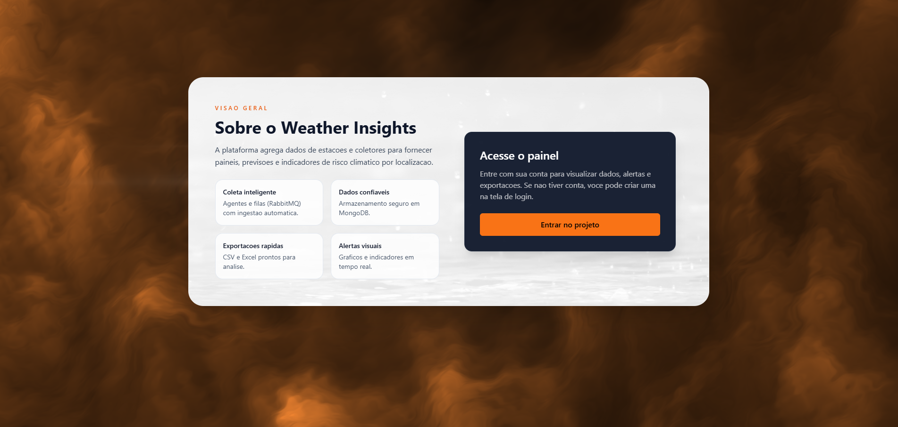
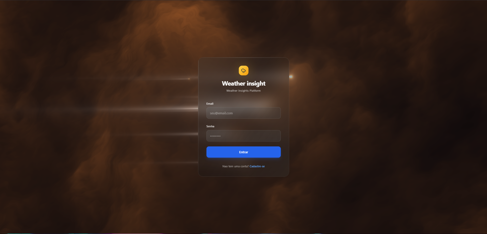
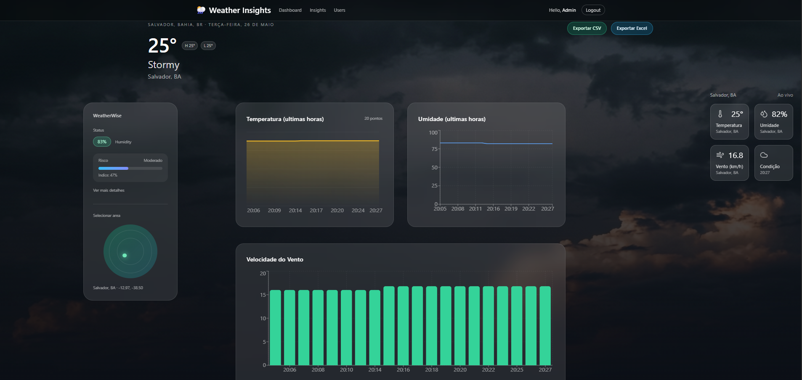
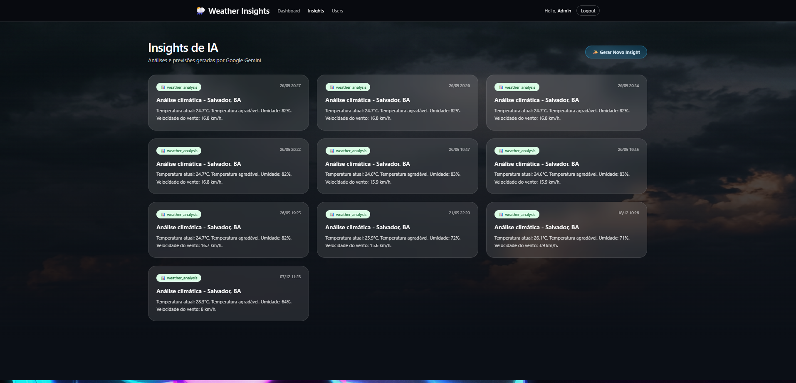
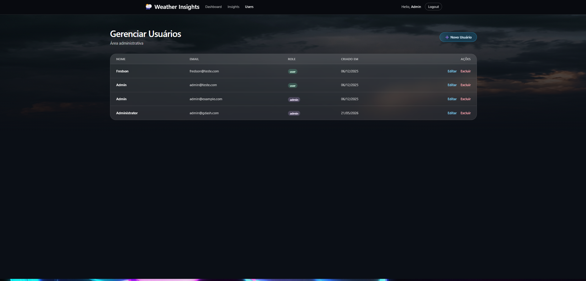
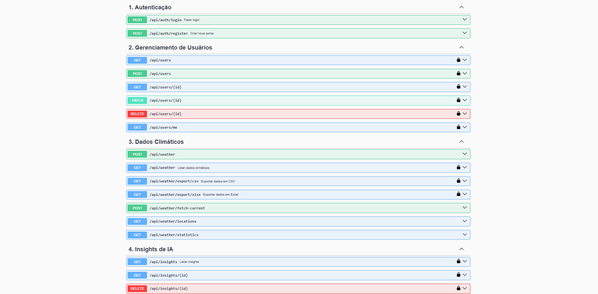

# Weather Insights Platform


Sistema full-stack de monitoramento climático em tempo real com pipeline de dados distribuído e geração automática de insights por IA.

## 📹 Demo

[▶️ Assista ao vídeo de demonstração completa (5 min)](https://www.youtube.com/watch?v=2C0LK7ftcAo&feature=youtu.be)

## 📸 Screenshots

### Landing Page (Início)
Tela inicial com apresentação do projeto e acesso para autenticação.




### Tela de Login


### Dashboard Principal
Monitoramento climático em tempo real com gráficos interativos de temperatura, umidade e velocidade do vento.



### Insights de IA
Análises automáticas geradas por IA sobre as condições climáticas.



### Gerenciamento de Usuários
Painel administrativo para controle de acesso e gestão de usuários.



### Documentação da API (Swagger)
API RESTful totalmente documentada com Swagger, organizada por módulos funcionais.



## 🎯 Sobre o Projeto

Weather Insights Platform é uma aplicação completa que demonstra a integração de múltiplas tecnologias modernas para criar um sistema robusto de monitoramento meteorológico. O projeto implementa um pipeline de dados distribuído que coleta, processa, armazena e exibe informações climáticas em tempo real, além de gerar insights automaticamente através de algoritmos de IA.

### Principais Características

- 🌤️ **Coleta Automática**: Dados meteorológicos coletados a cada 60 segundos via Open-Meteo API
- 🔄 **Pipeline Distribuído**: Arquitetura de microsserviços com message broker para processamento assíncrono
- 📊 **Dashboard Interativo**: Interface moderna com gráficos em tempo real e visualização de dados
- 🤖 **Insights de IA**: Geração automática de análises e recomendações baseadas nos dados climáticos
- 🔐 **Autenticação Completa**: Sistema JWT com controle de acesso baseado em roles
- 👥 **Gestão de Usuários**: CRUD completo com painel administrativo
- 📥 **Exportação de Dados**: Download de relatórios em formatos CSV e XLSX
- 🐳 **Containerização**: Ambiente completo orquestrado via Docker Compose

## 🛠️ Stack Tecnológica

### Backend
- **NestJS** - Framework Node.js com TypeScript seguindo Clean Architecture
- **MongoDB** - Banco de dados NoSQL com Mongoose ODM
- **JWT** - Autenticação stateless
- **Swagger** - Documentação automática da API
- **ExcelJS & json2csv** - Geração de relatórios

### Frontend
- **React 18** - Biblioteca UI com hooks modernos
- **Vite** - Build tool de alta performance
- **TypeScript** - Tipagem estática
- **Tailwind CSS** - Framework CSS utility-first
- **shadcn/ui** - Componentes acessíveis e customizáveis
- **Recharts** - Biblioteca de gráficos responsivos
- **Axios** - Cliente HTTP

### Pipeline de Dados
- **Python 3.11** - Collector que integra com Open-Meteo API
- **RabbitMQ 3.12** - Message broker para comunicação assíncrona
- **Go 1.21** - Worker de alto desempenho para processamento de mensagens

### DevOps
- **Docker & Docker Compose** - Containerização e orquestração
- **Health Checks** - Monitoramento de disponibilidade dos serviços

## 🏗️ Arquitetura

### Fluxo de Dados

```
┌──────────────┐     ┌───────────┐     ┌──────────┐     ┌──────────┐
│   Python     │────▶│  RabbitMQ │────▶│    Go    │────▶│  NestJS  │
│  Collector   │     │   Queue   │     │  Worker  │     │   API    │
└──────────────┘     └───────────┘     └──────────┘     └──────────┘
                                                               │
                                                               ▼
                                                         ┌──────────┐
                                                         │ MongoDB  │
                                                         └──────────┘
                                                               │
                                                               ▼
                                                         ┌──────────┐
                                                         │  React   │
                                                         │ Frontend │
                                                         └──────────┘
```

### Clean Architecture (Backend)

O backend segue os princípios de Clean Architecture com separação clara de responsabilidades:

```
services/api/src/
├── core/                    # Camada de Domínio
│   ├── domain/
│   │   ├── entities/       # Entidades de negócio
│   │   ├── repositories/   # Interfaces de repositórios
│   │   └── use-cases/      # Casos de uso da aplicação
│   └── ports/              # Interfaces de adaptadores
├── application/            # Camada de Aplicação
│   └── services/           # Services de orquestração
├── infrastructure/         # Camada de Infraestrutura
│   ├── database/          # MongoDB, schemas, seeds
│   ├── ai/                # Lógica de geração de insights
│   ├── export/            # Serviços de exportação
│   ├── external-apis/     # Integração Open-Meteo
│   └── queue/             # Cliente RabbitMQ
└── presentation/          # Camada de Apresentação
    ├── controllers/       # Endpoints REST
    ├── dtos/             # Data Transfer Objects
    ├── guards/           # Guards de autenticação
    └── filters/          # Exception filters
```

## 🚀 Como Executar

### Pré-requisitos

- Docker Desktop (versão 20.10 ou superior)
- Git

### Instalação

1. Clone o repositório
```bash
git clone https://github.com/fredson0/weather-insights-platform.git
cd weather-insights-platform
```

2. Inicie todos os serviços
```bash
cd infrastructure/docker
docker compose up -d
```

3. Aguarde a inicialização (20-30 segundos para health checks)

4. Acesse as aplicações

- **Frontend**: http://localhost:5173
- **API/Swagger**: http://localhost:3000/api
- **RabbitMQ Management**: http://localhost:15672 (guest/guest)

### Credenciais de Teste

O sistema cria automaticamente um usuário administrador na primeira inicialização:

```
Email: admin@example.com
Senha: 123456
```

## 📡 API Endpoints

A API REST está totalmente documentada com Swagger. Acesse http://localhost:3000/api para explorar todos os endpoints.

### Principais Rotas

**Autenticação**
```
POST /api/auth/register - Criar nova conta
POST /api/auth/login    - Autenticar usuário
```

**Dados Climáticos**
```
GET  /api/weather              - Listar histórico de dados
GET  /api/weather/locations    - Listar localizações
GET  /api/weather/statistics   - Obter estatísticas
GET  /api/weather/export/csv   - Exportar dados em CSV
GET  /api/weather/export/xlsx  - Exportar dados em Excel
```

**Insights de IA**
```
POST /api/insights/generate    - Gerar novo insight
GET  /api/insights             - Listar todos os insights
GET  /api/insights/:id         - Obter insight específico
```

**Gestão de Usuários** (Requer autenticação admin)
```
GET    /api/users     - Listar usuários
POST   /api/users     - Criar usuário
GET    /api/users/:id - Obter usuário
PATCH  /api/users/:id - Atualizar usuário
DELETE /api/users/:id - Remover usuário
```

## 🧪 Verificação do Sistema

Verifique o status de todos os serviços:

```bash
docker compose ps
```

Saída esperada (todos devem estar "healthy" ou "running"):
```
NAME                STATUS
mongodb             Up (healthy)
rabbitmq            Up (healthy)
api                 Up (healthy)
collector           Up
worker              Up
web                 Up
```

Para visualizar logs em tempo real:
```bash
# Todos os serviços
docker compose logs -f

# Serviço específico
docker compose logs -f api
```

## 🛑 Encerrando a Aplicação

```bash
docker compose down

# Para remover também os volumes (limpa banco de dados)
docker compose down -v
```

## 🎨 Features em Destaque

### Dashboard Interativo
- Cards com métricas principais (temperatura, umidade, vento)
- Gráficos de linha para visualização temporal
- Atualização automática de dados
- Filtros por localização e período

### Sistema de Insights
- Análise automática de padrões climáticos
- Classificação de condições (quente, frio, agradável)
- Alertas de eventos extremos
- Recomendações baseadas em dados históricos

### Gestão de Usuários
- Controle de acesso baseado em roles (admin/user)
- Painel administrativo completo
- Validação de dados com feedback visual
- Confirmações para ações críticas

## 💡 Decisões Técnicas

### Por que Clean Architecture?
Separação clara de responsabilidades, facilitando manutenção, testes e evolução do código. As regras de negócio ficam isoladas no core, independentes de frameworks.

### Por que Go no Worker?
Performance superior e modelo de concorrência nativo (goroutines) ideal para processamento de filas de mensagens com alto throughput.

### Por que RabbitMQ?
Garante que nenhuma mensagem seja perdida mesmo se a API estiver temporariamente indisponível. Implementa retry automático e dead letter queue.

### Por que MongoDB?
Flexibilidade no schema para dados meteorológicos que podem ter campos variáveis. Ótimo desempenho para queries de séries temporais.

## 📚 Aprendizados

Este projeto demonstra:
- ✅ Integração de múltiplas linguagens em um único sistema
- ✅ Arquitetura de microsserviços com comunicação assíncrona
- ✅ Padrões de Clean Architecture e SOLID
- ✅ Containerização e orquestração de serviços
- ✅ Autenticação e autorização robustas
- ✅ Integração com APIs externas
- ✅ Processamento de dados em tempo real
- ✅ Geração de insights com algoritmos inteligentes

## 🔮 Possíveis Evoluções

- [ ] Testes automatizados (unitários e e2e)
- [ ] CI/CD com GitHub Actions
- [ ] Deploy em cloud (AWS/GCP/Azure)
- [ ] WebSockets para atualizações em tempo real
- [ ] Notificações push para alertas climáticos
- [ ] Suporte a múltiplas localizações
- [ ] Machine Learning para previsões
- [ ] Modo escuro na interface

## 👤 Autor

**Fredson Santana Machado Filho**

- GitHub: [@fredson0](https://github.com/fredson0)
- LinkedIn: [linkedin.com/in/fredson-santana-machado-filho-912655329](https://www.linkedin.com/in/fredson-santana-machado-filho-912655329/)


---

<p align="center">Desenvolvido com ❤️ usando TypeScript, React, NestJS, Python e Go</p>

